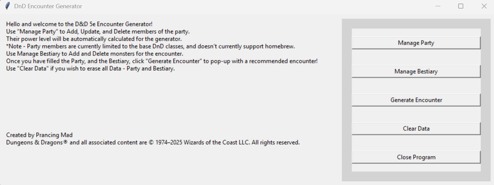
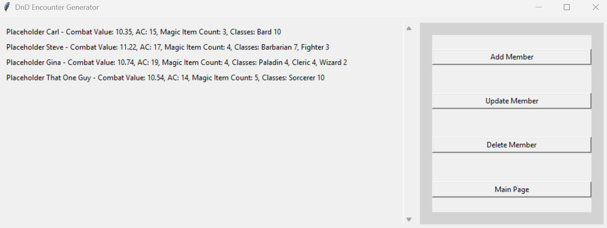
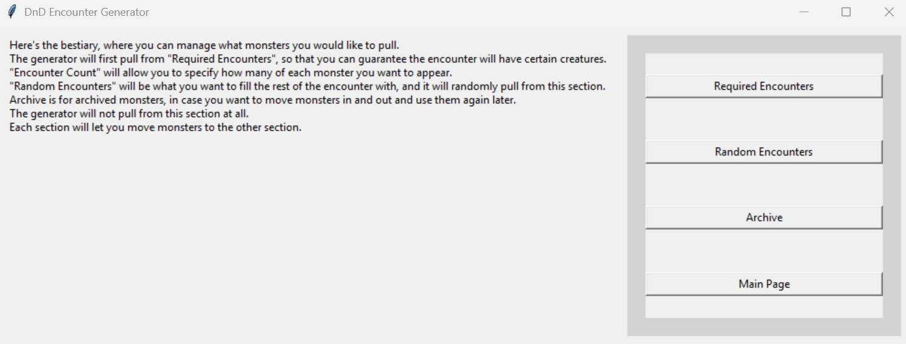
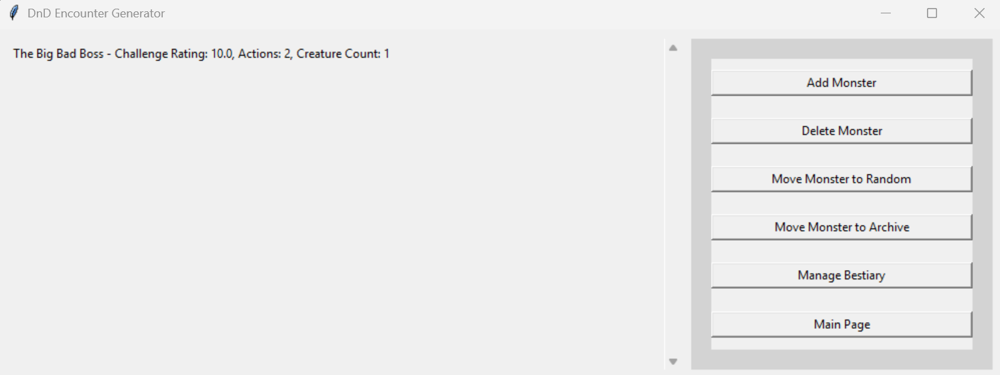
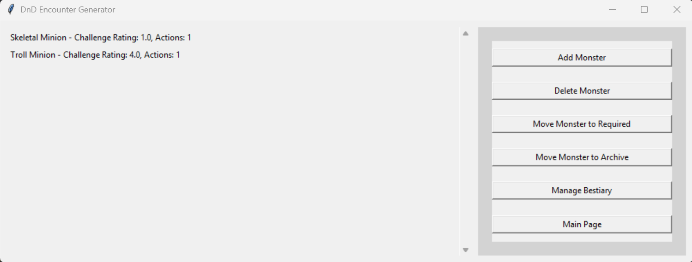
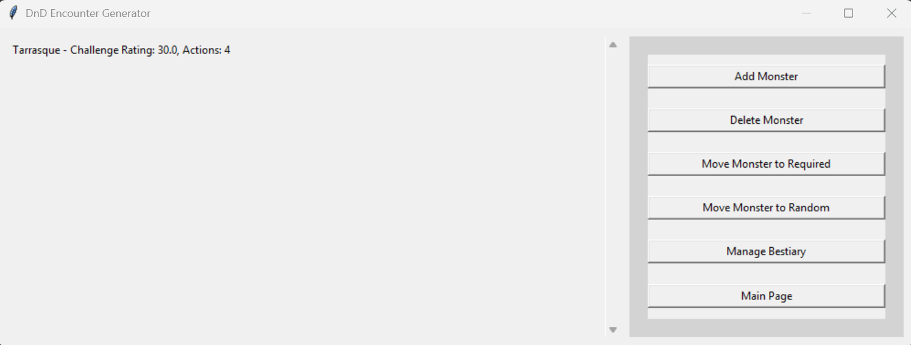
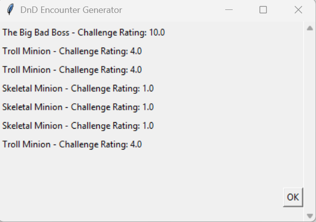

# D&D Encounter Manager

A Python Tkinter application for managing Dungeons & Dragons parties, monsters, and generating balanced encounters.

## Features

- Manage party members (add, update, delete)
- Manage bestiary (add, delete, move monsters between Random, Required, and Archive)
- Generate balanced encounters based on party combat value and actions
- Clear all data safely
- Scrollable GUI for large parties or bestiary lists

## Installation

1. Clone the repository:

```bash
git clone https://github.com/prancingmad/dnd_encounter_generator.git
cd dnd_encounter_generator
```

2. Install Python 3.10+ if not already installed.
3. Install required packages (if any; Tkinter is standard with Python):

```bash
pip apt-get install python3-tk
```

4. Run the application:

```bash
python3 main.py
```

## File Structure

- `generate_encounter.py` - Logic to generate balanced encounters
- `gui_functions.py` - GUI components and page management functions
- `player.py` - Player class and combat calculations
- `update_member.py` - Update party member information
- `show_error.py` - Simple popup error messages
- `config.py` - File paths, constants, and modifiers
- `party.json` - Stores party members
- `random.json`, `required.json`, `archive.json` - Stores monsters for encounters

## Usage

### Main GUI / Home Page


From the main page, you can navigate to party management, bestiary management, and generate encounters.

### Manage Party Page


Add, update, or delete party members. Displays each member's combat value, AC, magic items, and classes.

### Manage Bestiary Page


Add monsters to the bestiary, move them between categories, or archive them.

### Required Encounters Page


Lists monsters that must always appear in encounters.

### Random Encounters Page


Lists monsters that can be randomly included in generated encounters.

### Archive Page


Stores monsters that are not actively used in encounters.

### Generate Encounter Popup


Generates a suggested encounter based on the party's total combat value and actions, combining required and random monsters.

## Example party.json Snippet

```json
[
  {
        "name": "Placeholder Carl",
        "armor_class": 15,
        "magic_items": 3,
        "combat_value": 10.35,
        "actions": 1.5,
        "classes": [
            {
                "name": "Bard",
                "level": 10
            }
        ]
    }
]
```

## Notes

- Encounters are generated dynamically and are not saved by default.
- Combat values and actions are calculated based on class levels, armor, magic items, and certain class-specific modifiers.
- Multiclass characters are supported.
- The app requires the party and monster JSON files to exist (they can start empty).

---

Developed using Python 3 and Tkinter.

